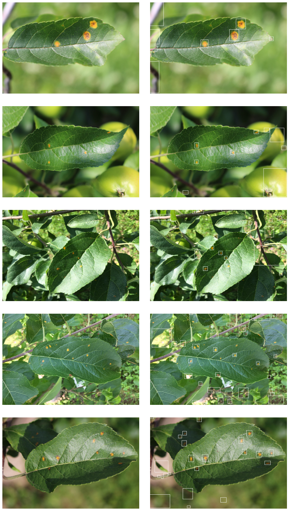

### Using OpenCV to detect and mark rust patches in tree leaves.

> This is data from kaggle's Plant Pathology 2020 competetion. [DataSet Link](https://www.kaggle.com/c/plant-pathology-2020-fgvc7/data)

So i didn't win the competetion, and didn't even tried to train a network but i cam eup with something interestig instead. I was experimenting with the data and found out a simple way to detect and draw bounding boxes around rust in unhealthy leaves.

Here are some examples.

Yeah, Not the state of the art detection i know, but considering that any kind of neural netowk hasn't been used it is pretty great.